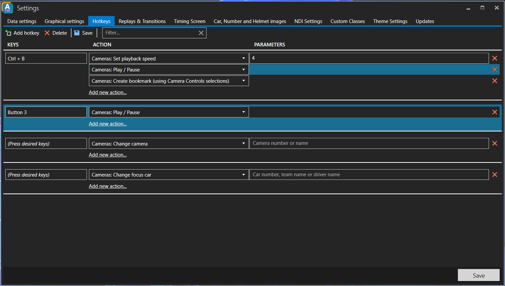

# Hotkeys

Starting with version 1.48, ATVO supports configurable hotkeys to perform various kinds of actions. Most actions are related to controlling the cameras and replay system, or to control the theme.

Hotkeys currently support the following input devices:
* Keyboard combinations
* Gamepads, joysticks, Xbox controllers and similar devices*
* Streamdeck\* and Bitfocus Companion\*

\*Note: Gamepads and Streamdeck support must be enabled explicitly in the Hotkey settings.

## ATVO hotkeys and Theme hotkeys

It is important to distinguish hotkeys and the actions they can perform in ATVO itself, or in the theme you have loaded. 
* ATVO hotkeys are defined in ATVO and work with any kind of theme (or without a theme loaded). ATVO hotkeys mostly control the cameras and replay system.
* Theme hotkeys are defined by the theme and depend on what theme you have loaded. If you have created a Theme Editor theme, you can add hotkeys to run certain actions yourself. For professional themes, the hotkeys can be found and configured in the Theme Settings.

In most cases, the hotkeys will work even when the ATVO application is not in focus or in the foreground of Windows. The hotkeys will function even when other applications, such as iRacing, have the focus. One notable exception is Xbox controllers, which do require ATVO to be in focus for the button press to be registered. See also the note on Xbox controllers below.

## Configuring hotkeys
* To configure ATVO hotkeys, find the Hotkeys tab in the ATVO settings.
* To configure theme hotkeys in professional themes (such as ATVO Theme 2023), find the Hotkeys tab in the Theme Settings, under the ATVO settings.
* To configure theme hotkeys in your Theme Editor themes, modify the theme in the editor and set the Hotkey property of a button.

To add a new hotkey with one or more actions:
* Click `Add hotkey` in the toolbar to add a new row.
* Click into the textbox that says `(Press desired keys)` and hit your desired keyboard shortcut, or input device button. The textbox should display your shortcut or the button number that you used.
* Use the dropdown under Actions to select the desired action. You can also add more actions if desired.
* Some actions may require some input parameters. In that case, a `Parameter` textbox will appear where you can enter the desired value. For example: the action to set the playback speed requires you to enter the desired speed.

## Keyboard shortcuts are registered globally system-wide
When using *keyboard shortcuts*, note that the shortcuts are usually registered system-wide. This means the same shortcut cannot be used for anything else, in any other application, for as long as ATVO (or the theme) is running. For example: if you would bind the shortcut "A" to an action, you can no longer use the A key for anything else, in any application, including typing it anywhere.

## USB device input support

Hotkeys also support various kinds of USB input devices, including gamepads, wheels or most button boxes. This must be enabled explicitly by checking 'Enable input from gamepads, joysticks and similar devices'. To use such an input device as a hotkey, ensure the 'Press desired keys' input is in focus and then click your device button.

When using a gamepad or similar device button to register a hotkey, try to keep the device plugged into the same USB port. When switching USB ports, the device name may change and the hotkey will no longer work.

### Xbox controllers require ATVO to have focus
When using an Xbox 360 or Xbox One controller, the ATVO application unfortunately must be in focus. When another application is active, the controller button presses will not be registered. This limitation is not present for most other input devices.

## Streamdeck
A Streamdeck device can be used as a Camera Controls button box as well as for custom hotkeys. To use Streamdeck, install the `Appgineering ATVO` plugin and then enable the `Use Streamdeck` setting. The plugin is included with ATVO and can be installed from the ATVO - Hotkey settings, next to the option to Use Streamdeck. Soon, the plugin will also be featured in the Streamdeck store.

The Streamdeck plugin consists of two actions:
* Camera Controls
* Custom Hotkeys

### Camera Controls
From the Streamdeck editor in Windows, drag a Camera Controls action to your Streamdeck to create a new button. Select the button and use the `Type` dropdown to change the kind of command to use. When the button is pressed and ATVO is running, the corresponding action will be performed.

### Custom Hotkeys
From the Streamdeck editor in Windows, drag a Custom Hotkey action to your Streamdeck to create a new button. Select the button and give it a unique `Name`. The name is what distinguishes this action from other custom hotkeys. Ensure this name is unique, otherwise it will conflict with existing hotkeys or trigger unwanted actions!
In your desired hotkey editor (ATVO Hotkey settings, or Theme settings), select the hotkey you wish to execute when the Streamdeck button is clicked (make sure it has keyboard focus). Next, press the button on your physical Streamdeck device to link the hotkey. The hotkey input in ATVO should say: `Streamdeck: [Name]`.

## Bitfocus Companion
We also provide a module for the Companion app to use alongside Streamdeck. This module has the same functionality as the Streamdeck plugin and offers the same Camera Controls and Custom Hotkeys actions. Ensure the Name you give to your Custom Hotkey actions is still unique to avoid conflicting with other hotkeys.

### Installing the ATVO Companion module
The Companion module is a zip file that must be downloaded separately and extracted anywhere on your computer. Next, you must configure Companion to look for developer modules on startup so it can find the module.

1. [Download the module here](https://download.appgineering.com/atvo-bitfocus-companion/latest/atvo-companion-module.zip)
2. Create a new folder somewhere on your computer and call it 'Companion modules', for example `C:/Users/Your name/Documents/Companion modules`
3. Extract the module zip file into the new folder, for example `C:/Users/Your name/Documents/Companion modules/companion-module-atvo`
4. Start Companion and click the 'settings' cog in the top-right corner to expand the advanced settings.
5. Under 'Developer modules path' select the folder from step 2 (**not** the `companion-module-atvo` folder, but its parent)
6. Launch GUI. Add a new Connection and find `ATVO Appgineering`.
7. Once connected, the Camera Controls and Custom Hotkeys actions will become available.