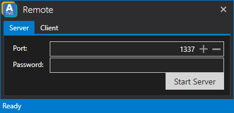
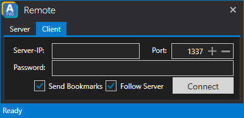

# ATVO

It is possible to remote control ATVO. This is especially helpful in a professional environment using multiple computers for production.
While it is possible to use the ATVO Remote Feature over the internet, you will achieve the best results if the computers are on the same network.

To use ATVO Remote over the internet you most likely need to set up port forwarding (TCP) on your router.
We highly recommend to also specify a password if you want to use ATVO Remote. After setting up port and password just hit the **'Start Server'** button.

Other ATVO clients can connect to the **'ATVO Remote Server'** by entering the corresponding IP address, ATVO Remote port and password of the server.

#### Send Bookmarks
If checked the bookmarks will be kept in sync between server and client.

#### Follow Server
If checked the client will follow the actions of the server. For example if the server changed the camera, the client will do the same.
