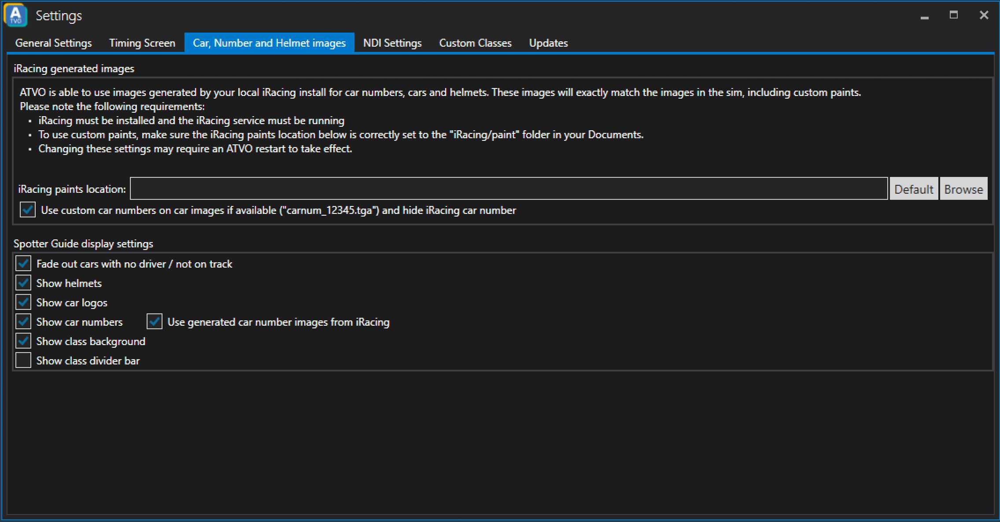

# Timing Screen Settings

## iRacing generated images
ATVO can make use of the iRacing generated images for cars, numbers and helmets. 
See the instructions and requirements on screen.

## Spotter Guide display settings
ATVO provides a couple of options to customize the appearance of the spotter guide.

### Fade out cars with no driver / not on track
Checking this option will fade out the tiles in the spotter guide of cars that have no driver or are not currently on track.

### Show helmets
Shows the helmets of the drivers in the spotter guide.

### Show car logos
Shows car logos in the spotter guide.

### Show car numbers
Shows the car numbers in the spotter guide.

#### Use generated car number images from iRacing
Uses the car numbers generated from iRacing

### Show class background
Uses the class color as a background of the tiles.

### Show class divider bar
Shows a dividing bar between classes.