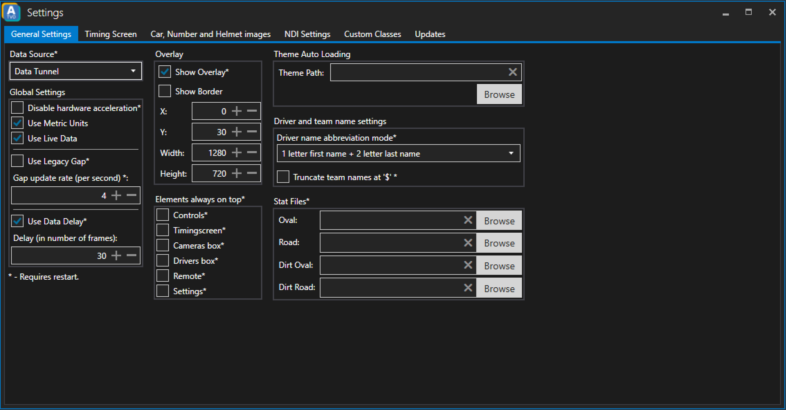

# General Settings

## Data Source
This dropdown is used to select where you want to receive data from. Default value is iRacing, but it can also be changed to Data Tunnel or Telemetry Recorder depending on which data source you would like to use.

*Note: changing the Data Source requires a restart of ATVO*

## Global Settings
### Disable hardware acceleration
When checked hardware acceleration is disabled. This is an experimental feature since the effect varies depending on your use-case and system.

_Note: changing this settings requires a restart of ATVO_

### Use Metric Units
When checked ATVO uses metric values. Otherwise it will use imperial values.

### Use Live Data
Toggles live data (i.e. live positions, etc.)

### Use Legacy Gap
It is not recommended to use Legacy Gap calculation since it is less accurate. But if you encounter any problems with the calculation of gaps it might be worth a try.

### Gap update rate (per second)
Changes the update rate for gap calculation.

### Use Data Delay
You can delay the data you receive from the specified data source. Default is 30 frames. It helps keeping the overlay and the simulation in sync.

## Overlay
### Show Overlay
Enables the overlay rendering.

### Show Border
Shows a border around the overlay canvas.

### Positioning offset (x/y)
Specifies where to draw the overlay. If the overlay should be drawn starting in the very top left corner of the screen use the following setting:
* X: 0
* Y: 0

### Overlay resolution (Width/Height)
Using this setting you can specify the resolution/canvas size of the overlay. It is highly recommended to not use overlays larger than 1920x1080.

## Elements always on top
Check which part of ATVO should always be rendered on top. This especially helps in hectic situations during a production since you will not need to look for a window you need to use right away.

## Theme Auto Loading
You can specify the path to an ATVO theme file using the _Browse_ button. Doing so will automatically load the specified theme after starting ATVO.

## Driver and team name settings
### Driver name abbreviation mode
This drop down allows you to choose how the driver names should be abbreviated. The following options are available:
#### 1 letter first name + 2 letter last name
Example: Tom Smith would be **TSM**
#### 1 letter first name + 1 letter last name
Example: Tom Smith would be **TS**
#### 3 letters last name
Example: Tom Smith would be **SMI**
#### 2 letters last name
Example: Tom Smith would be **SM**

### Truncate team names at "$"
Enabling this option will truncate team names at the _$_ sign.

Example:
_Team Appgineering $Blue_ would appear as _Team Appgineering_ in the overlay.

_Important: Remember to restart ATVO after changing this setting._

## Stat Files
You can use csv-files exported from the iRacing website to get additional information. (Experimental)