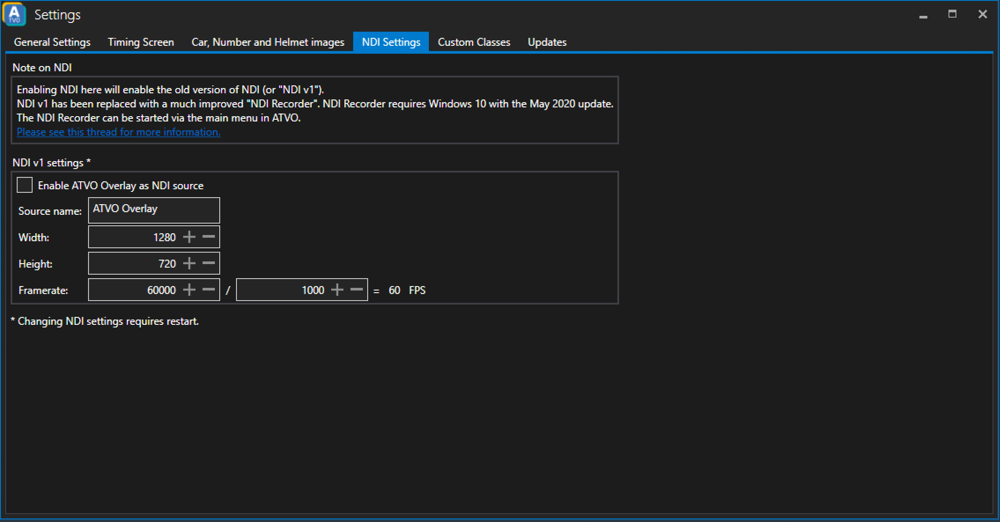

# NDI Settings

Please read the note on NDI inside of ATVO.

## NDI v1 settings
### Enable ATVO Overlay as NDI source
You can send the ATVO overlay over the network via NDI. 

### Source name
Specify a recognizable name for the NDI source.

### Width
Specify the width of the NDI source.

### Height
Specify the height of the NDI source.

### Framerate
Adjust the framerate of the NDI source. 60 FPS is a good target for smooth animations and transitions.
