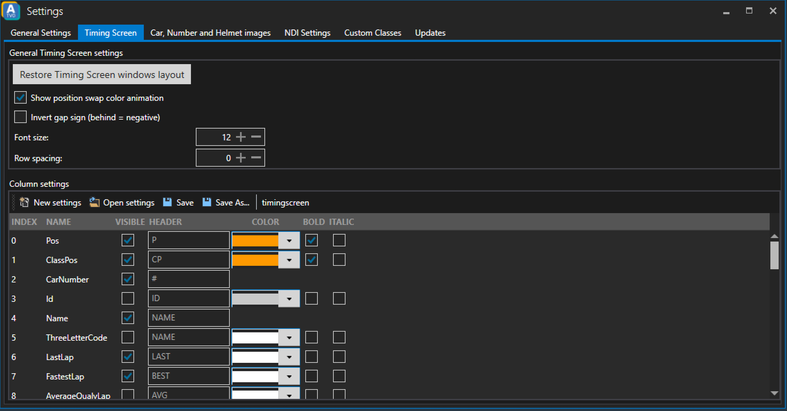

# Timing Screen

## General Timing Screen Settings
### Restore Timing Screen windows layout
Clicking this button will reset the layout of the timing screen window to its default.

### Show position swap color animation
Defines whether a position swap color animation should be used or not.

### Invert gap sign
If enabled gaps will be shown with a minus sign. So _+0.123_ would become _-0.123_.

### Font size
Defines the font size in the timing screen. Default: 12.

### Row spacing
Defines the row spacing in the timing screen. Default: 0.

## Column settings
The _Column settings_ section lets you define how the layout of the timing screen should look like. Define colors and which columns to show.
You can also save your settings and import those settings later using the _Open settings_ button.

The meaning of each column is described in the [Timing Screen documentation](../../timing-screen/standings/#timing-screen-columns).