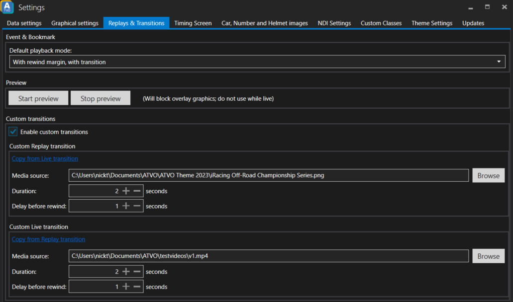

# Replays & Transitions

The Replays & Transitions settings can be used to choose your own custom transition media, and to determine the default playback mode for Event and Bookmarks (e.g. play with or without transition, and play with or without margin).

## Default playback mode
When playing back Events or Bookmarks, the right-click menu offers four different modes, plus one "default" mode. This setting controls the behavior of the default mode.

The meaning of rewind margin and transition are:
* With / without rewind margin: "with rewind margin" rewinds to a time a few seconds before the actual event (margin), while "without" rewinds to the exact event time.
* With / without transition: "with transition" delays the replay while playing a transition media, while "without" skips the transition and jumps to the replay immediately.

## Preview
You can use the Preview to see your currently active transition in action, and fine-tune the duration and delay settings. Your overlay will be covered by a big 'REPLAY'/'LIVE' screen, so do not use this during live streaming.

## Custom transition media
When using replays with a transition, you can choose to use your own media by enabling the `Enable custom transitions` checkbox. Then, you have to choose your own media and settings.

### Media formats
We support several kinds of videos, gifs and static images as the transition media. Transparent MOV videos are also supported in most cases. If your video does not play, perhaps your format is not supported.

### Duration and Delay settings
The Duration setting controls for how long the transition is visible. If you are using a video or gif, make sure to match this to your video length (or a bit less) to avoid the video pausing and showing the last frame for too long.

The `Delay before rewind` setting controls when the actual replay or live transition is performed. Usually, you want to perform this while the screen is fully blocked by your transition media, so that the transition is hidden behind your video.

Note that replays that go very far "back in time" may take longer to rewind, in which case it may be possible that the transition has not yet completed in time. It is worth building in some extra buffer time (where the screen is still covered) to avoid such cases.

## Custom transition can be overridden by your active Theme
Note that some themes allow you to override the custom transition. If the theme supports transition overrides, and you have enabled the override, then the settings on this page do not apply. Instead, use the settings on the Theme Settings.