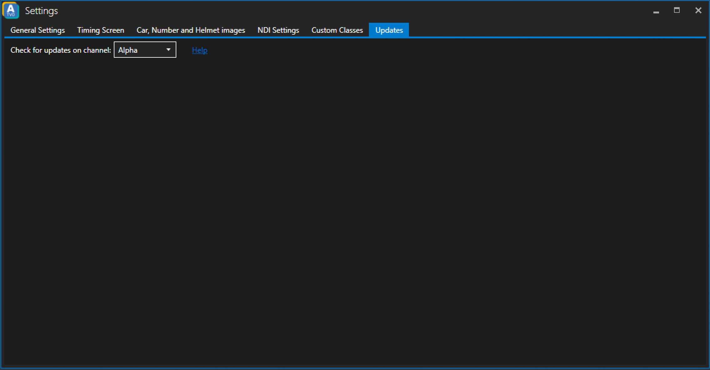

# Updates

## Update Channel
ATVO offers three different channels for updates.

_Note: Whenever you change the update channel you **must** restart ATVO. On restart the ATVO launcher will download the latest version of the channel you have selected._

### Alpha
Latest "bleeding edge" updates of ATVO. Not recommended for production use.

### Beta
Latest beta version of ATVO which can include bugfixes and features that are still missing in the stable version.

### Stable
The most robust and tested version of ATVO. Might not have the latest features, but should ensure a good user experience especially in a productive environment.