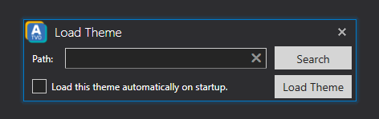

# Theme

In the Theme menu you can choose whether you would like to load a new theme into ATVO or to close the currently loaded theme so you can load another theme.
Once clicked on **'Load'** the **'Load Theme'** dialog will appear.

In this dialog you can manually enter the path to the theme file or search for the desired theme file on your system using the **'Search'** button. Once you have selected an ATVO theme file (.atf & .atd filetypes will work) simply click on the **'Load Theme'** button to load the theme.
If you wish to automatically load the selected theme on startup simply check the box **'Load this theme automatically on startup.'** before loading the theme.
