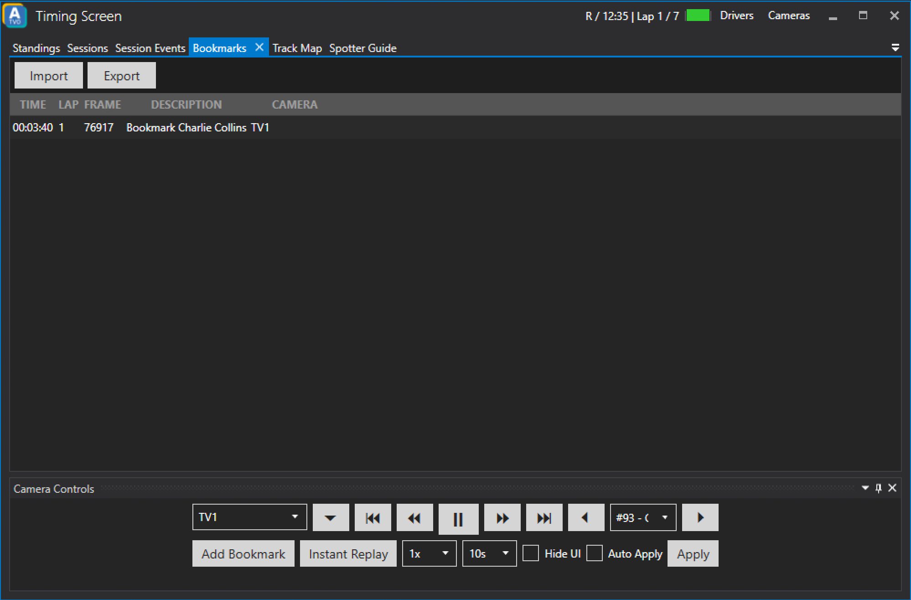

# Bookmarks

The bookmarks tab lets you manage bookmarks. This includes importing and exporting bookmarks as well as using the bookmarks for a replay and deleting bookmarks.
To use a bookmark for a replay simply right-click on the bookmark you want to use and choose one of the replay options. Deleting a bookmarks works the same way, simply right-click a bookmark and choose *Delete*

The following right-click options exist:

#### Replay (rewind margin)
This option rewinds to the timestamp of the bookmark plus an additional margin - this is helpful to also capture how the situation of your bookmark developed (i.e. right before a crash another driver made it three-wide).

#### Replay (exact)
This option lets the replay jump to the exact timestamp of the bookmark.

#### Delete
Deletes the selected replay.

### Import
The *Import* button opens a new dialog and expects the user to point to a valid bookmark csv-file.

### Export
The *Export* button opens a new dialog to export a valid bookmark csv-file.

