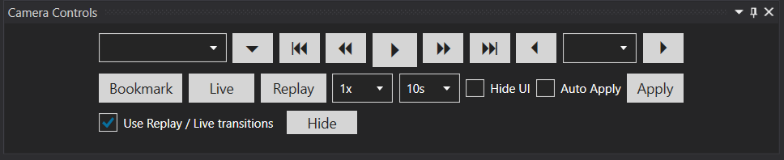
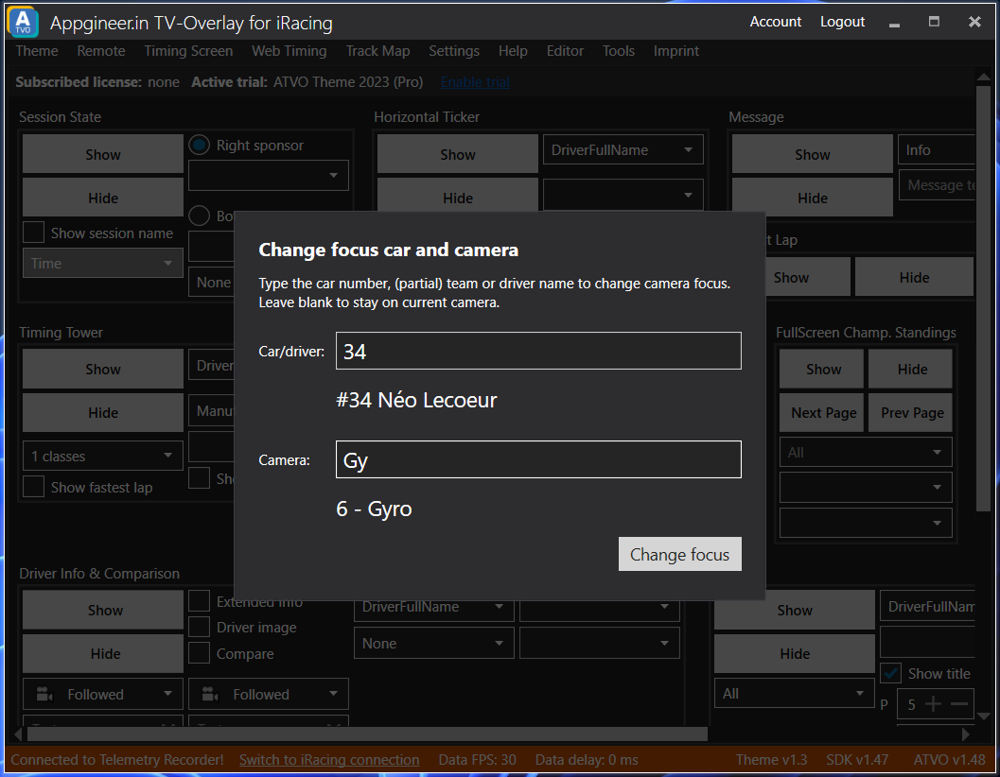

# Camera Controls

You may have noticed the camera controls in the bottom of the timing screen. This little tool helps you control the cameras in the sim.

## Hotkeys
Almost all of the actions available from the Camera Controls can also be performed via hotkeys. Please read the [ATVO hotkeys documentation](../../hotkeys) for more information.

## Streamdeck
Almost all of the actions available from the Camera Controls can also be performed via a Streamdeck device. Please read the [ATVO Streamdeck documentation](../../hotkeys#streamdeck) for more information.

## Camera actions

### Camera dropdown
The camera dropdown lets you select the camera for the selected driver or scene. The dropdown is populated with the cameras you have configured in iRacing.

### Playback controls
Using the playback controls you can pause, resume, (fast) forward and (fast) rewind.

### Driver and scene selector dropdown
This dropdown lets you select which scene (i.e. Leader, Most Exciting) or which driver to follow.

### Add Bookmark
Adds a bookmark at the very moment you press this button. A bookmark is typically used to mark a interesting moment of the session you might want to jump back to (for example to analyze an incident).

### Live / Replay
The Replay button triggers a replay. By default the replay will jump back 10 seconds in time and play in real-time speed (1x), but different options can be selected.

The Live button will jump back to the previous state (camera and focus driver), just before you started a replay.

### Replay speed dropdown
This dropdown lets you select which playback speed should be used for the replay.

### Replay jump back in time dropdown
By default 10 seconds. Defines the amount of seconds you want to jump back in time when a replay is triggered.

### Use Replay/Live transitions
When checked, clicking Replay or Live will use your selected transition media during the replay or live transition. Check out the Replay & Live Transitions settings.

### Hide UI
If you check this checkbox the iRacing UI will be hidden.

### Auto Apply
When checked every action will be executed immediately.

### Apply
Executes the selected actions (i.e. switching to a new camera or driver).

## Quick Switch camera and focused car

To quickly switch to another camera or focused car, you can use the Quick Switch Camera popup. 

The popup can only be triggered via hotkeys via one of two actions:
* Popups: Change Driver Focus
* Popups: Change Camera Focus
Both actions will cause ATVO to jump to the foreground, and will show the same popup. In the case of Change Driver Focus, the driver input textbox will be active so you can immediately start searching for the driver. In the case of Change Camera Focus, the camera name input textbox will be active instead.

You can quickly search for a driver or camera by inputting a part of their name or number. You can also search for multiple partial matches by using a period "`.`". Your search is separated by the `.` symbols and each part may become a partial match.

For example, if you are looking for the driver `Max Verstappen` you can match that name using any of the following searches (provided there are no other names that match):
* `M`
* `Max V`
* `M.V`
* `M.Ver`
* etc...

## Did you know?
As many other parts of ATVO you can undock and dock the *Camera Controls* elsewhere. Simply drag and drop the *Camera Controls* in its subtitle bar. To dock it again you can just drag the camera controls over another ATVO window and it will present you docking options.

