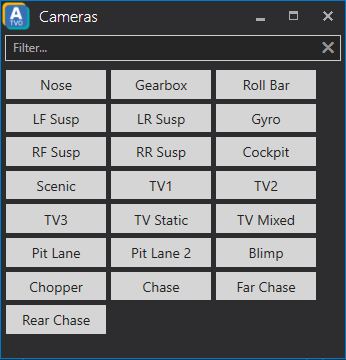

# Cameras
The camera button box can be accessed via the *Camera* button in the top right corner of the timing screen window.

The camera button box will appear in a separate window allowing you to change the camera by a press of a button.
You can also use the *Filter...* text field to filter for a certain camera you want to use but might not find at first glance.

