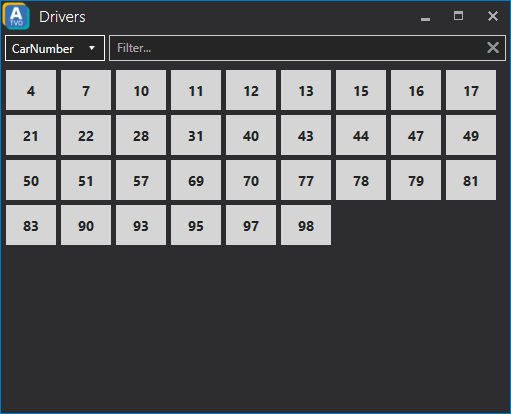

# Drivers
The drivers button box can be accessed via the *Drivers* button in the top right corner of the timing screen window.

The drivers button box will appear in a separate window allowing you to change the camera by a press of a button.
You can also use the *Filter...* text field to filter for a certain driver you want to follow.

By default the drivers are represented by their car number in ascending order. The dropdown menu in the top left corner can be used to change the appearance of the drivers inside the drivers button box.
Following self-explanatory options are available:
* CarNumber
* LastName
* FullName
* Team

