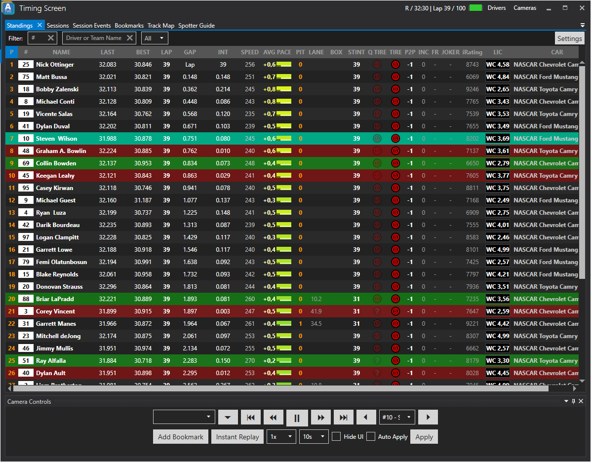

# Timing Screen

The built-in Timing Screen will offer useful information for you and your broadcast crew.
The provided information includes the current position of drivers, their name and best lap just to name a few. Of course the timing screen offers plenty of information.
By default it also includes camera controls on the bottom of the window.

Use the Timing Screen settings to specify which information you would like to be displayed on the timing screen.

