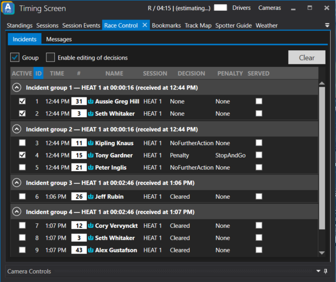
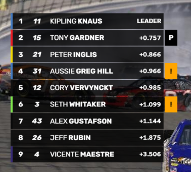

# Race Control

ATVO has the ability to receive messages and track incidents, investigations and penalties which come from a remote live race control. The purpose is to **display** this information in your broadcast graphics overlay. The information comes from a remote race control application such as our [ATVO Remote Race Control tool](../tools/remote-race-control.md), or in the future from third party race control applications.

Race control messages and incident information can be shown on your graphics directly via the remote race control connection, without the graphics operator having to perform any actions.

## Summary

* Your ATVO graphics instance starts the Remote - Race Control server.
* ATVO Remote Race Control connects to your ATVO to send race control messages or incident information.
* Messages and incident investigation / penalty information can be displayed in your graphics automatically, controlled from the remote clients.

## Display only

Please note that race control is meant only to **display** information about incidents and messages, there is no connection to iRacing that actually hands out penalties to drivers on track. Handing out actual penalties is up to your own live race control systems, or via third party applications.

## How to use

To use Race control, your main ATVO instance (the one showing the graphics overlay on stream) must act as the Remote Race Control **server**. Another application (such as ATVO Remote Race Control) must connect to this server by acting as a **client**.

### Server

To start the Race control *server*, use the option `Remote - Race Control` via the main menu bar. The server window will pop up where you can configure the desired port and optional password. You most likely need to set up port forwarding (TCP) on your router, and possibly in your Windows Firewall.
Make sure the port that is specified in the server has been forwarded in your router, using the right protocol (TPC) and the right local IP address. 

### Client

To connect to an ATVO Race control server, you can use [ATVO Remote Race Control tool](../tools/remote-race-control.md). In the near future, we plan to support third party race control applications as well.

If connecting over the internet (not over local LAN), make sure to connect using the *public* IP address of the server.

## Timing screen

Race control messages and incidents are displayed in the Race control tab of the Timing screen for the ATVO instance that hosts the Remote Race Control Server. The server can also directly modify or update the incidents here if desired.

## Incidents

An entry is considered **under investigation** when the remote race control has started an incident for that entry. The entry remains under investigation until either race control has decided on the incident. At that point the incident may be turned into an active penalty, or be cleared as a warning or no further action. A penalty must be cleared or marked as 'served' to be removed.

## Broadcast graphics

If your graphics theme has been configured to show remote race control incidents and messages, then any connected client can send this information to your ATVO graphics to display in the broadcast. 

### ATVO Theme 2023 

For example, our built-in ATVO Theme 2023 supports showing drivers who are either 'under investigation' or have an active penalty, and will show the message widget when a remote message is sent.

### Theme Editor

In the Theme Editor, you can build support for showing incidents using the bindings `rc_investigation` or `rc_penalty` for any `standings` dataset. The `racecontrol_incidents` dataset returns all incidents in sequence of newest to oldest. 

Messages are returned via the `racecontrol_messages` dataset in sequence of newest to oldest.

Finally, you can listen for the `RaceControl` event via an Event Trigger which will be triggered when a new message is received.