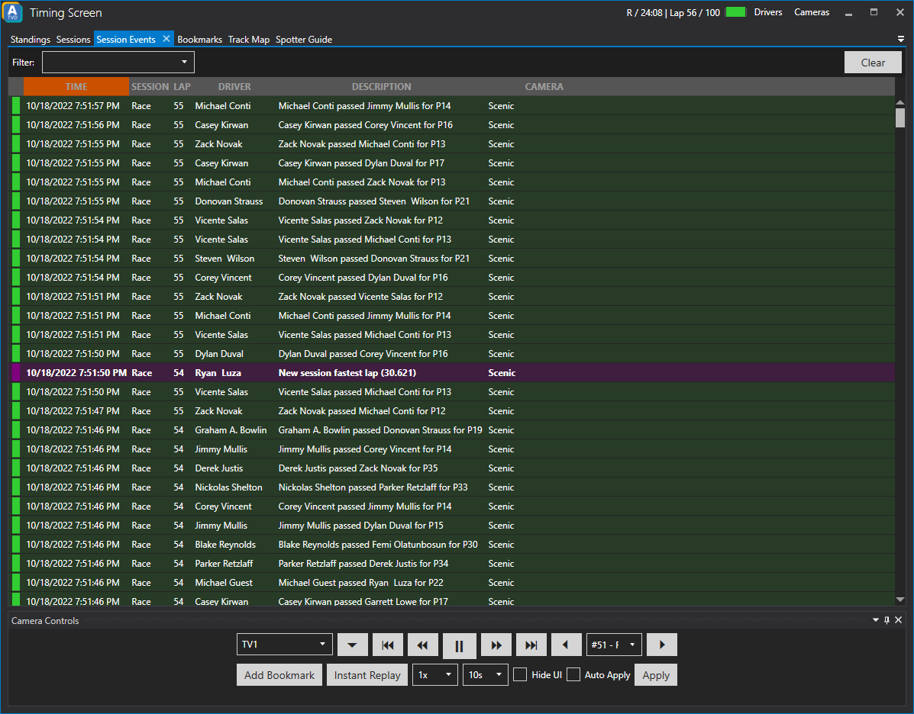

# Session Events

The Session Events tab visualizes different kind of events.

Session events include:
* Overtakes
* Fastest laps
* Slow car on track
* Possible crash of a car
* Pit stops
* Pit exit
* Driver swaps
* Offtrack incidents

## Tweaking sensitivity of 'slow car' and 'crashed car' events

If you are unhappy with the detection of slow and crashed cars, you may try tweaking various settings that control the detection sensitivity.

This is reserved for advanced users, so there is no user interface to control these settings. Instead, you'll have to change a configuration file found in your AppData folder:
`%appdata%/ATVO/crash_settings.ini`

The crash settings configuration file has several categories and settings that you can change. Each setting is explained below. Make sure you only change the value, not the name of the setting or category, otherwise the default value will be used instead.

### Available settings

| Category | Setting                   | Default | Explanation                                                                                                                                                                              |
|----------|---------------------------|---------|------------------------------------------------------------------------------------------------------------------------------------------------------------------------------------------|
| pace     | slowpacethreshold_road    | 0.3     | (Road) Cars are reported as slow if their current pace is X seconds below their average pace.                                                                                            |
| pace     | slowpacethreshold_oval    | 0.3     | (Oval) Cars are reported as slow if their current pace is X seconds below their average pace.                                                                                            |
| pace     | crashedpacethreshold_road | 0.75    | (Road) Cars are reported as crashed if their current pace is X seconds below their average pace.                                                                                         |
| pace     | crashedpacethreshold_oval | 1.0     | (Oval) Cars are reported as crashed if their current pace is X seconds below their average pace.                                                                                         |
| delays   | minimumbelowpacetime      | 0.33    | The minimum time (seconds) that a car must be below their average pace. This value should be well below 0.5 seconds and is intended to stop spurious events from e.g. laggy connections. |
| delays   | minimumtimebetweenevents  | 5       | The minimum time (seconds) between consecutive slow or crash reports, to avoid duplicate reports of the same incident.                                                                   |
| delays   | waitaftergreenflagtime    | 5       | Do not report incidents within X seconds of the start of the race (green flag), to avoid cars getting up to speed being reported.                                                        |
| pit      | waitforpitentrytime       | 3       | Reports are delayed for this time (seconds). If the car drives into the pit lane during this time, no report will be generated to avoid cars braking for pit lane as being reported.     |
| pit      | waitafterpitexittime      | 10      | The minimum time (seconds) after pit exit to start reporting cars again, to avoid reporting cars getting up to speed from the pit exit.                                                  |

### Reverting to the default settings
If you want to revert to the default, simply delete the `crash_settings.ini` file and restart ATVO. A new file with default values will be generated.

