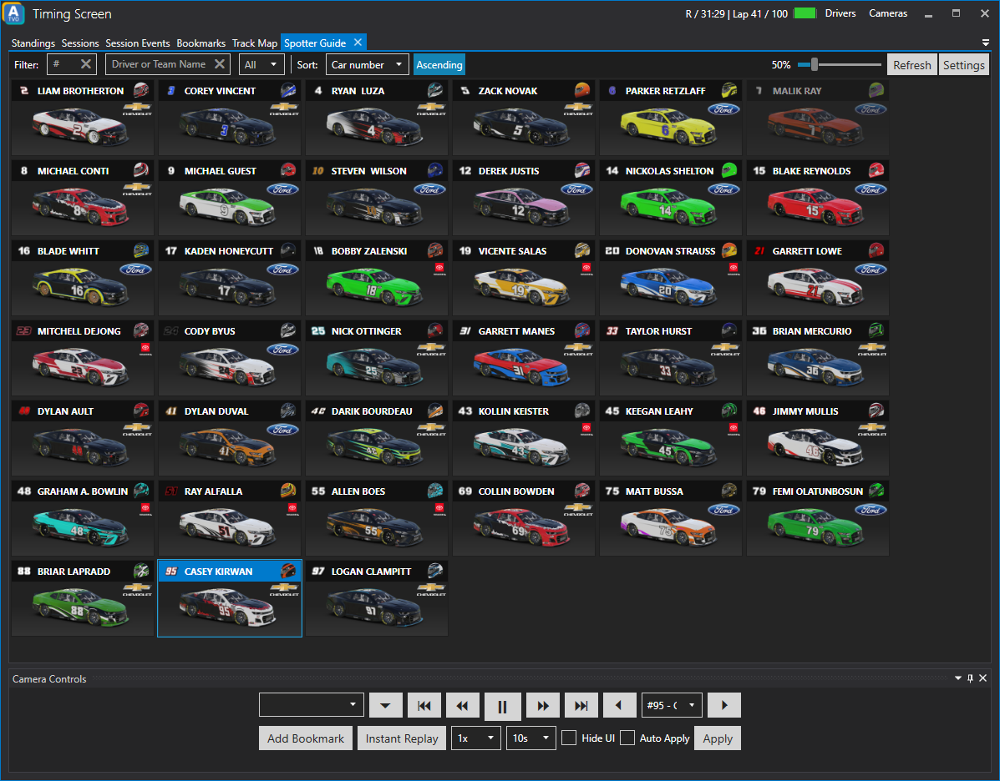

# Spotter Guide
The Spotter Guide is a great help for any producer as it shows a visualisation of the cars running in the session.

By default the cars and helmets will be displayed as they are on track. This means that if you are running a third-party software like [Trading Paints](https://www.tradingpaints.com/) the spotter guide will also show the liveries for cars and helmets. The car number is also shown as configured by the driver.
It also means that you might not have downloaded all liveries right away. Once you have downloaded (or manually extracted all liveries) you can simply hit the *Refresh* button in the top right corner to see the latest liveries in the spotter guide.

## Filter
### Car number (#)
This is the field for the car number filter. For example if you enter _**1**_ all cars with a car number that includes the number 1 (i.e. 1, 12, 71, 201) will be shown in the spotter guide.

### Driver or Team Name
Type a driver or team name to filter entries in the spotter guide by name (case-insensitive).

### Class dropdown
Using this dropdown you can select which classes you want to be shown in the spotter guide.

### Sort
Choose how you want to sort the entries in the spotter guide. Available options are:
* Car number
* Position
* Class position
* Driver name
* Team name
* Car name
* iRating

By clicking the **Ascending** button you can choose whether the sorting should happen ascending or descending.

