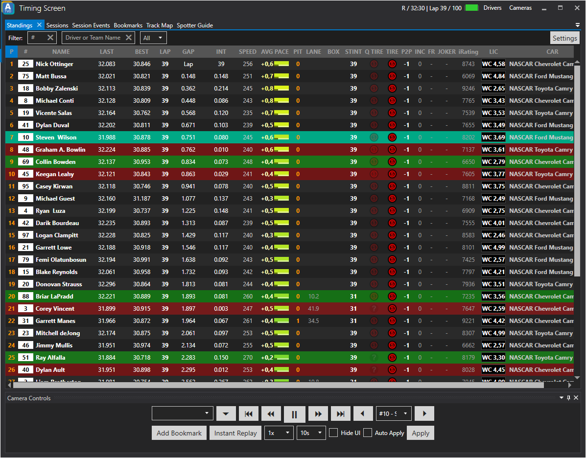

# Standings

The standings tab of the timing screen offers the best overview of the action on track. Here you can see position changes, get information about the latest lap times, get an indication of the current pace of a driver and so much more! Feel free to explore the settings of the timing screen and display all the information necessary for your broadcast.

