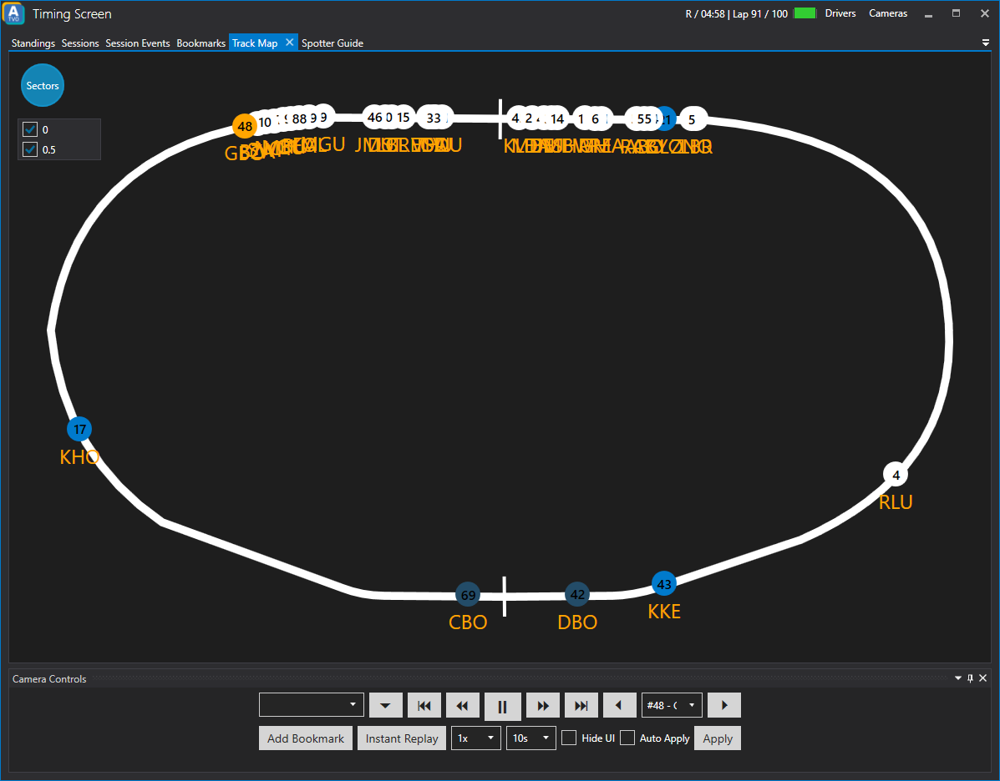

# Track Map
The built-in track map visualizes where the drivers are on track. As a broadcast producer you can get an idea where some action is about to happen at a glance.

## Sectors
In the top left corner you can open the *Sectors* menu which allows you to select the sector markers on the track map.
