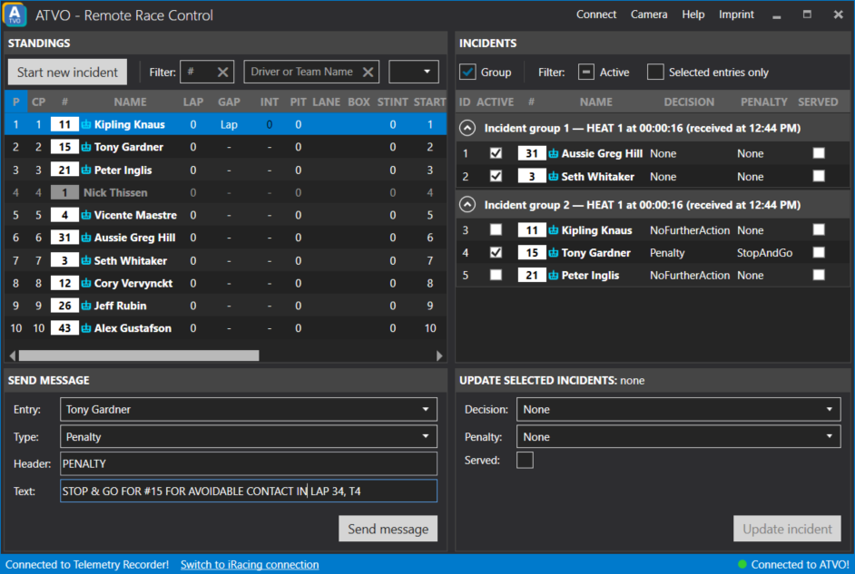

# Remote Race Control

Remote Race Control is a separate application that connects to your ATVO graphics to send race control messages and information about incidents and penalties.

Remote Race Control acts as a remote client to your [ATVO Race Control server](../timing-screen/race-control.md). Read the Race Control page for information on how to use the server.

## How to use

To use ATVO Remote Race Control you must connect to both iRacing and a (remote) ATVO race control server.

To connect to the race control server, use the Connect menu item. Submit the *public* IP address of the computer running the ATVO remote race control server, the port and the password and hit Connect.

The iRacing connection works the same as ATVO: it will find a live iRacing connection, or can also use the Data Tunnel or Telemetry Recorder connection.

## Sending messages

 Select the desired entry (optional) to which the message relates, set the type, header and text and send it. If connected, ATVO will receive the message and (if the graphics are configured correctly) display the message on the broadcast.

## Incidents

You can start incidents involving one or more drivers to mark them as 'under investigation' on the graphics. Incidents can then be updated with a specific decision, e.g. a penalty or warning or no further action. Entries under investigation or with a penalty will be marked in the broadcast graphics.

### Starting a new incident

Select one or more drivers in the Standings list, then click the `Start investigation` button. The server will return a list of incidents (one per selected driver) with a unique ID, displayed in the Incidents list on the right. 

### Updating one or more incidents

Select one or more incidents in the list, then change the Decision, Penalty and 'Served' flag and send the update. All selected incidents will be updated to reflect your changes.

### Active and inactive incidents

An entry is under investigation as soon as you start a new incident for them. The incident remains active until either:
* You update the incident to Clear, Warning or No Further Action. The incident is now completed and inactive.
* You update the incident to Penalty (but not served). The incident remains active but the driver is no longer marked as 'under investigation'.
* You mark a penalty as Served. The incident is now completed and inactive.