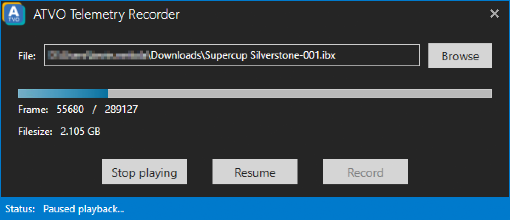

# Telemetry Recorder
Since iRacing does not provide proper telemetry data in replay files you can at least record the telemetry for ATVO using our *Telemetry Recorder*.

The *Telemetry Recorder* can also be used to playback telemetry files so you will be able to test your ATVO and Theme settings without joining an iRacing session.
For this to work you need to remember to change the data source in the settings of ATVO accordingly.

