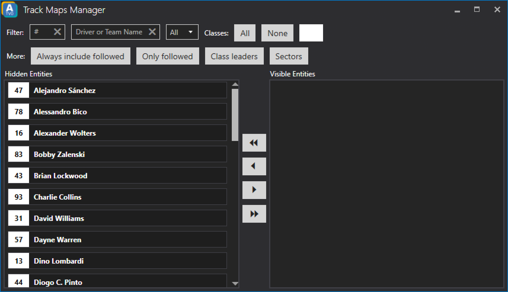

# Track Map

The Track Map Manager lets you configure what should be displayed on the track map. As usual you will have the same filtering options available as on the timing screen.

To show one or multiple drivers of your choice on the track map just select one or multiple drivers from the list of *Hidden Entities* and move them over to the list of *Visible Entities* using the single arrow pointing to the right.

To remove entities from the *Visible Entities* list simply select an entity and click on a single arrow pointing to the left.
You can also populate the list of *Visible Entities* with all available hidden entities by clicking the double arrow pointing to the left side. To remove all entities again use the double arrow pointing to the left side.

### Always include followed
Will also always add the followed driver to the list of visible entities.

### Only followed
Will only add the followed driver to the list of visible entities.

### Class leaders
Will add all class leaders to the list of visible entities.

### Sectors
Lets you select which sector markers to show on the track map.
