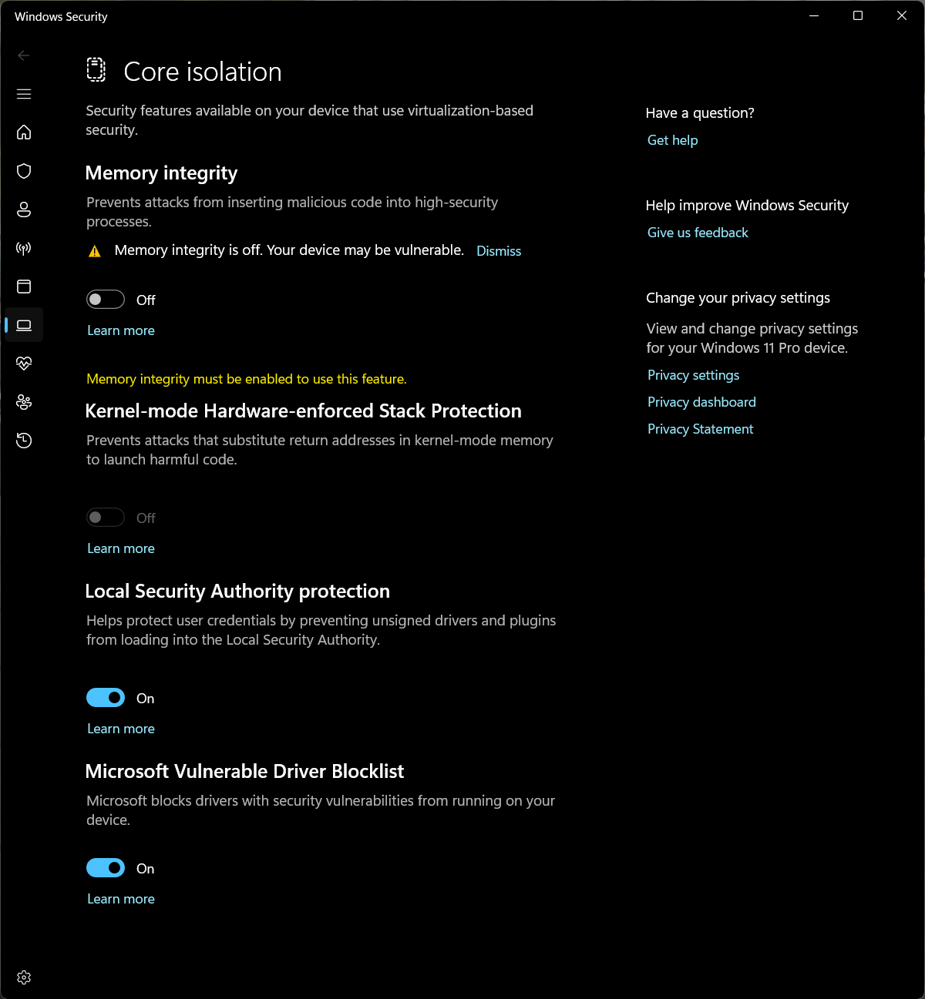
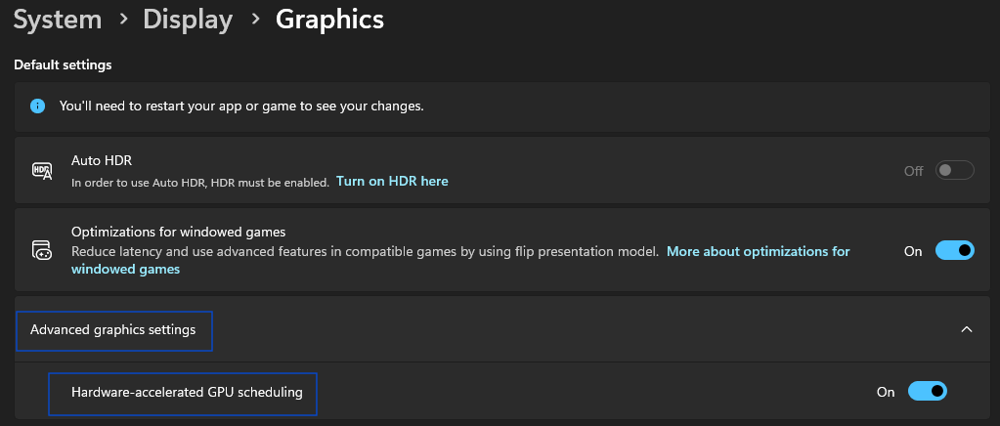

# Troubleshooting

In case you are having performance issues with ATVO, try changing these settings in your Windows settings.

## ATVO General

In case ATVO runs into performance issues, you can try changing the following.

### Core-Isolation Memory Integrity

Try turning off Memory Integrity within Core Isolation in Windows. To access this setting,
simply enter `Core Isolation` into the Windows search.

### Hardware-accelerated GPU Scheduling

Another setting would be to enable Hardware-accelerated GPU Scheduling.

### Game Mode

One thing you can play around with is Game Mode. See whichever setting works best for you in this case.

## NDI

See [NDI](./tools/ndi-recorder.md) for more info.
