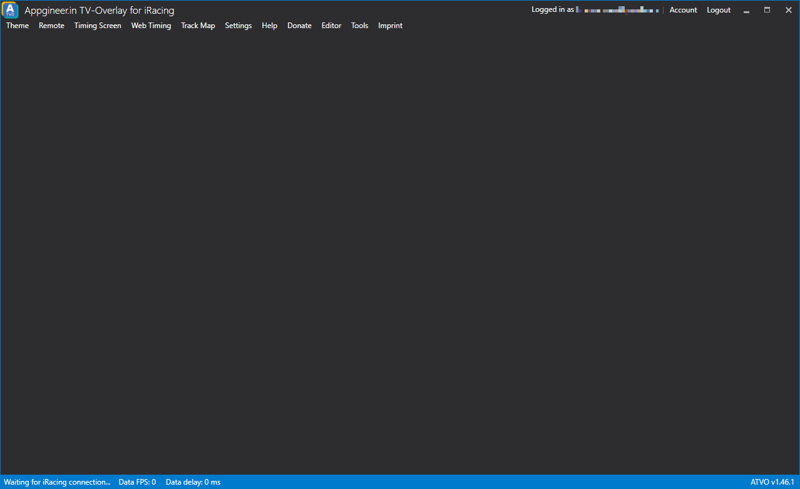

# UI Overview

## First Start
After starting ATVO you will be presented with the main window of the application overlayed by a login prompt. ATVO now requires you to use a ***free* Appgineering Account** which you can easily create within ATVO. Just follow the instructions on the screen to register an account or log in by entering the e-mail address and password of your Appgineering Account.
You can of course also check the option to remember your credentials if you wish to not enter your credentials on every start-up of ATVO.

*Note: The login screen is currently only available on the alpha channel of ATVO*

## Main window
Once you are logged you will see the ATVO main window in all its glory. It is not only the starting point of your production with ATVO, once a theme has been loaded it will also be host of your theme controls.

