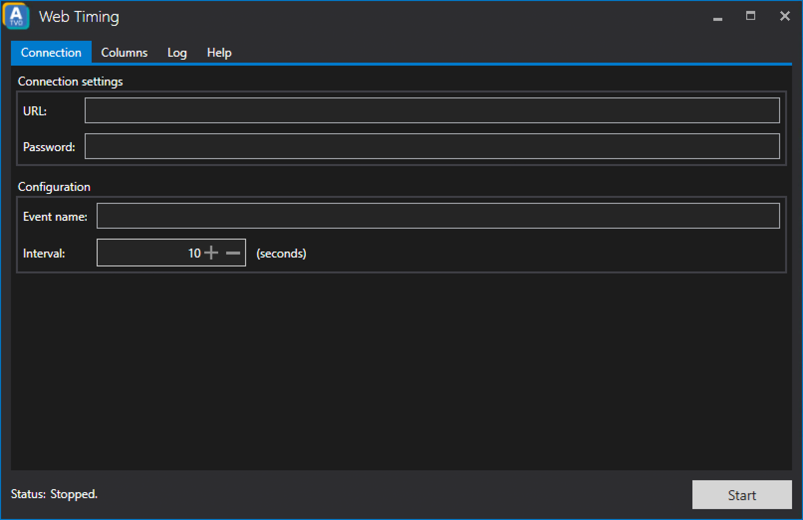

# Web Timing

ATVO allows you to provide a web timing for your audience. A demo of the webtiming (with static data) can be found here: 

* [Timing Screen](https://webtimingdemo.appgineering.com/#/timingscreen)
* [Events](https://webtimingdemo.appgineering.com/#/timingscreen)

## Setup

### System requirements
* Webserver (Apache or NGINX are recommended)
* PHP >= 5.0

### Setup outside of ATVO
1. You need to specify the web timing password in the *post.php* file.
2. Upload all files of the WebtimingServer folder to your webserver.
3. Ensure the *sessions* folder exists and the webserver has write access to it.

*Note: By default the web timing files can be found at C:\Program Files (x86)\Appgineer.in\ATVO Launcher\bin\WebtimingServer*

### Setup inside of ATVO
After clicking the web timing button in ATVO a new window will be shown.
1. Specify the URL of the webserver you uploaded the webtiming files to.
2. Enter the password you chose for the web timing.
3. Set a name for the event you want to broadcast and provide a web timing for.
4. Set up the update interval for the web timing. We recommend an interval of at least 3 seconds to ensure the webserver is not being flooded by the web timing module of ATVO. Too many requests can cause the web server to fail.
5. Connect to an iRacing session and click the *Start* button.
6. Check the *Log* tab of the Web Timing in ATVO if there any errors show up.

