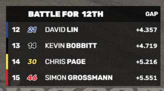

# Battle

The Battle widget is like a small version of the Tower widget, and displays a subset of the drivers. You can use it mostly for showing battles where cars are close together on track. You can choose how many drivers to show, and from which position to start.

## Selecting the start position
You can manually type in a start position, or use the handy special buttons to jump to a position:
* **P1**: jump to the leader
* **F**: jump to the currently followed car