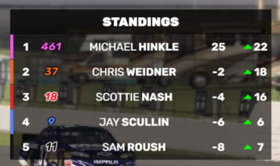

# Championship Standings Tower

The Championship Standings Tower widget can display the live championship after or during a session. When your Championship settings are configured correctly, the widget will also reflect the outcome of the current race. See the [Championship Standings settings](../../settings/championship-standings/) for more information on how to configure the championship.

## Display modes
The widget can be configured for various different display modes, including:
* Show or hide the driver name: by hiding the name you can show a much smaller widget with just car number and standings information.
* Show or hide Gain column: you can choose to display a 'Positions gained' or 'Points gained' column.
* Relative to P1: you can choose to display the points relative to the leader or as their absolute points.