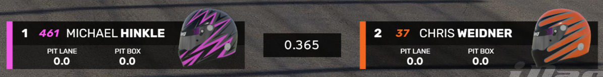
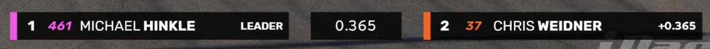

# Driver Info & Comparison

The Driver Info & Comparison widget can be used to show information about a specific driver (for example the driver currently being followed by the camera), or to compare information between two drivers.

## Display modes
The widget supports various different display modes that you can choose from the controls:
* Small mode showing just driver details and one additional info.
* Extended mode showing additional details such as pit stop, sector times, or any other info.
* Driver image enabled or disabled: show a driver headshot image or an automatically generated helmet image.
* Compare mode enabled or disabled: show one item or two with a gap time between them.

The widget in 'Extended' mode with driver images:

The widget in 'Small' mode:

## Selecting the drivers
To select which drivers or teams to display, use the driver selection dropdown. You can choose a specific driver in the session, or you can use the special selections at the top:
* Followed: track the driver that your camera is following
* Leader: track the leader
* Ahead: (for compare mode only) track the car ahead of the car selected in the other dropdown.
* Behind: (for compare mode only) track the car behind the car selected in the other dropdown.