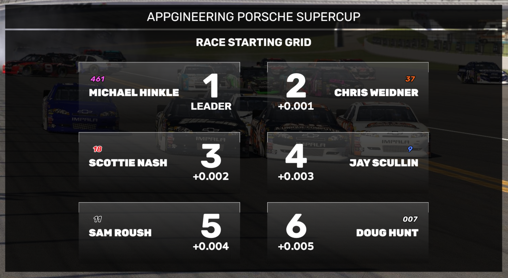
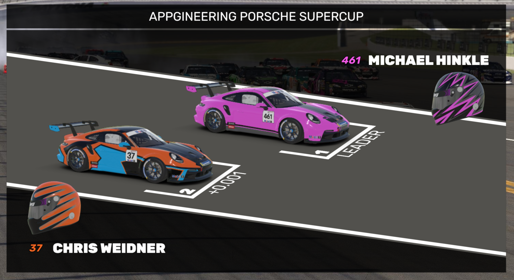

# Grid

The Grid widget is a full-screen widget that displays the grid starting order of the selected session. Use the Next Page button to scroll the grid to the next page of drivers.

## 3D grid
In the widget settings, you can choose to use a 3D grid instead of the regular grid. The 3D grid shows the cars of the drivers on a starting grid graphic. 

### 3D grid car images
Note: the 3D grid works best when you have enabled the "Generate car images" settings in the "iRacing generated images" settings. This ensures the car images are displayed properly and in the right perspective. 
You can still choose to use your own dynamic images through the "Dynamic Media - Driver car liveries" settings, and turning off "Generate car images" settings in the "iRacing generated images". In that case, make sure the car images are in the right perspective.

