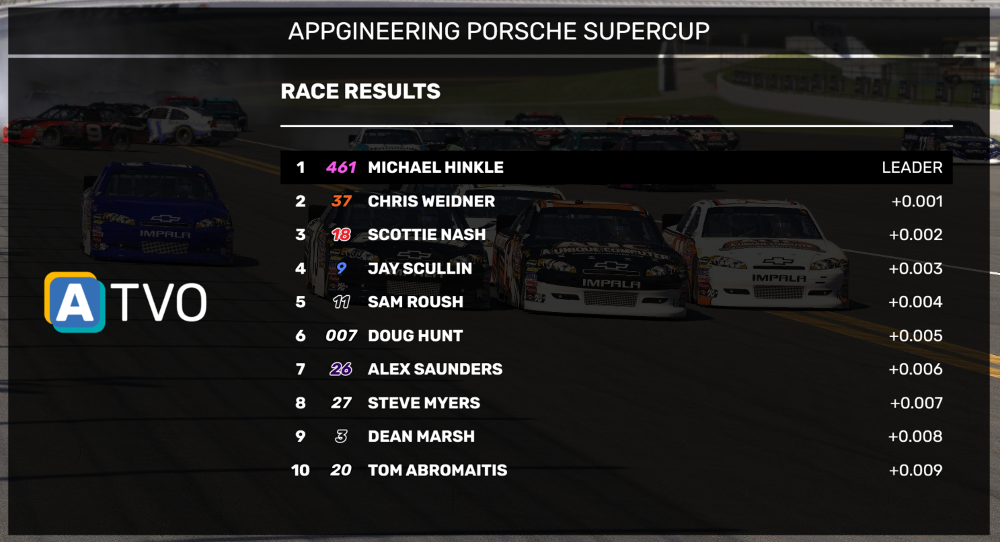

# Results

The Results widget is a full-screen widget that displays the results of a session. You can choose to show it at the end of a session, or also during a session for an intermediate update.
Use the Next Page button to scroll the results to the next 10 drivers. The leader/winner will keep showing on top.

## Logo
The sponsor logo on the left side can be configured under the Logos settings. If you choose the Custom logo option, and have configured the Dynamic Media - Sponsor image store, then you can also choose any custom logo via the dropdown in the results controls.