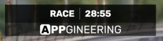
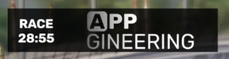

# Session State

The Session State widget shows useful information about the current session, including time or laps remaining and flag states (green, yellow, white, gridding, etc). You can also choose to display the name of the current session or keep it hidden.

## Sponsor display modes
The Session State widget can be displayed with a sponsor logo to the right side or to the bottom side. The behavior and look of the widget will slightly change depending on your selection.

## Flag states
The widget will automatically change appearance to show the current flag state for:
* Green flag
* Yellow flag / cautions
* White flag (last lap)
* Checkered flag
* Replay 
* Gridding
* Formation lap

## Time and laps remaining
If the current race has a time limit, the widget will show the time remaining.
If the race has a lap limit, you can also choose to show the laps remaining.

## Sponsor images
It can also show sponsor images either on the right-hand side or the bottom of the widget. You can select from a set of predefined ATVO logos or choose your own custom images if your license is high enough.

### Predefined ATVO logos
Select the desired logo in the theme settings in the Logos tab.

### Custom sponsor images
To use custom sponsor images in the session state widget, you must:
* Enable the Custom logo option for the Session State (and bottom Session State) in the Logos settings under theme settings.
* Select a folder with your sponsor images under Dynamic Media - Sponsors tab.

Now, the dropdowns on the Session State controls should contain the list of images to select from.
