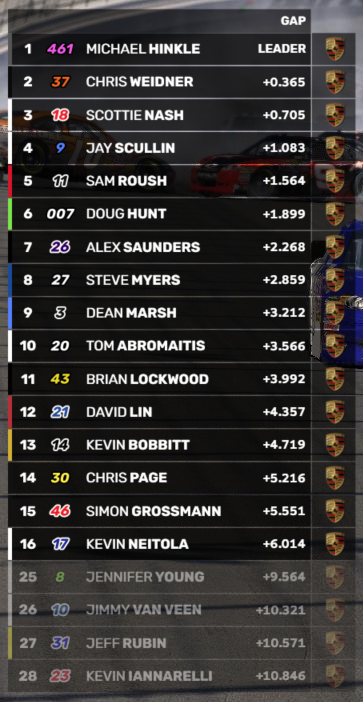

# Timing Tower

The Timing Tower widget is a live race ticker at the left side of the screen. It is able to show multiple classes at the same time (grouped or together). You can choose how many items to show per class, and how many of them are to be 'variable'. The top N items are 'static' and always show position 1 - N, while the remaining variable items page through the rest of the positions. You can configure these numbers in the Timing Tower settings.

## Classes
You can choose to show all classes, or a mix of multiple classes grouped.

## Additional information
The ticker items can show up to 2 sets of additional information such as gaps, intervals, pitstop info, etc. Select the desired two modes via the dropdowns on the control screen. The tower will extend in width to accomodate the size of the information, and show an extension for the second item automatically.

## Fastest lap
When enabled on the control screen, the entry with the fastest lap can be highlighted with a colored background and optionally with a stopwatch icon (enable in the settings).

## Pitstops
When enabled in the settings, the items can show pitstop information when the car enters the pitlane. You can configure to show the pit lane or box time.

## Push-to-pass
When enabled in the settings, the items can show a Push-to-pass animation for entries activating P2P.

## Appearance
Various aspects of the widget can be tuned via the Widget settings under Widgets - Timing Tower.