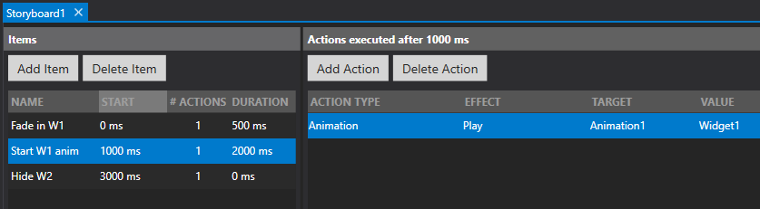

# Storyboards

A Storyboard can be used to easily control a flow of consecutive actions at specific time intervals. You can add several storyboard Items to a Storyboard, where each item has its own configurable Start time, and a list of Actions to execute at that specific time.

A Storyboard is meant to replace complex control flows involving multiple timers. Instead the control flow is contained in a single Storyboard.

When you start a Storyboard, it will periodically check if it is time yet to start the next item. Once an item has reached its start time, all the Actions defined in that item will execute. The storyboard continues until all items have been executed, at which point it stops.

You can also give each item a name, but this is only used for your convenience so you can find items in long lists easier.

Finally, each item also knows the duration of the actions it will execute. Not all actions have a duration, but especially animations (as well as fading when showing or hiding widgets) know how long they play for so the items will reflect that time. This can further help you decide how long to delay each item for.

## Storyboard editor
Below screenshot shows the editor where you control your Storyboard:

You can change the order of items by dragging/dropping them in place.

### Storyboard actions
Storyboards can be started and stopped via the Restart and Stop storyboard actions. When you Restart a storyboard, any running instances are stopped first to ensure only one instance of the storyboard is running.

If you wish to start a storyboard from within itself (for a recursive infinite loop of the same storyboard), you can use the "Start new instance" action instead of the "Restart" action. Start new instance will play a new copy of the storyboard independently of any already running copies and allows you to run multiple copies of the same storyboard simultaneously, as well as allowing infinite recursively looping storyboards. Note that stopping a storyboard will immediately stop all instances.

### Timing resolution
Please note: for performance reasons, the start time of an item is only accurate to about 100 ms. If you specify start times with greater resolution (like actions starting 10 ms apart), then they will be grouped together at 100 ms intervals. For more precision use timers.